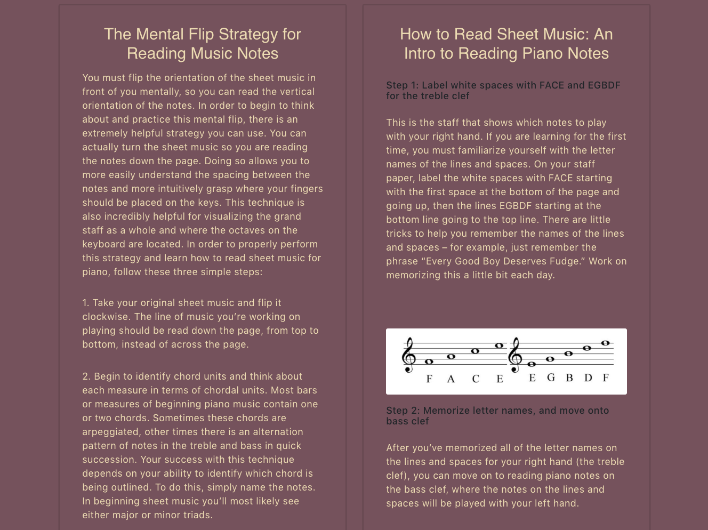
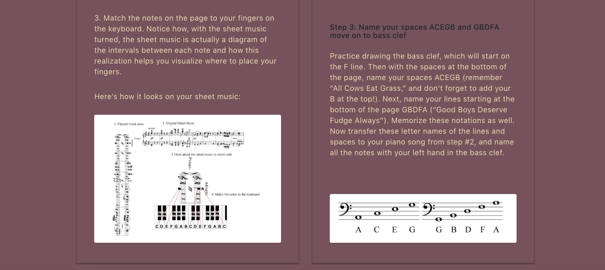
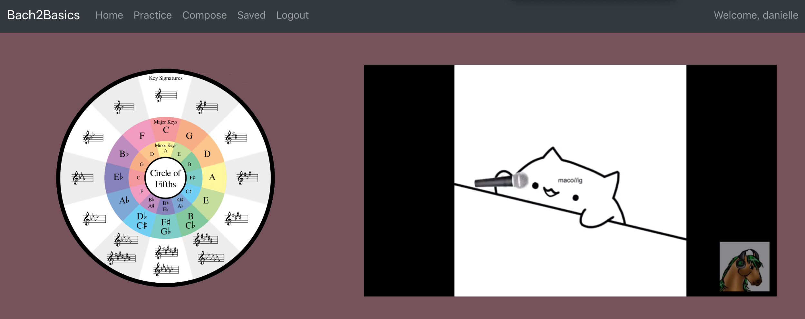
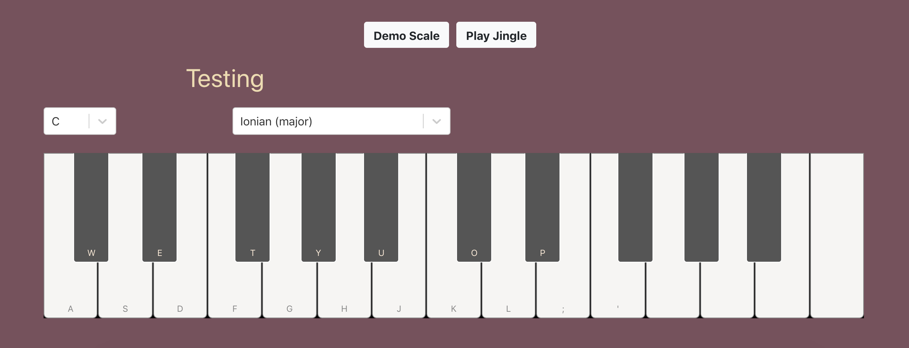
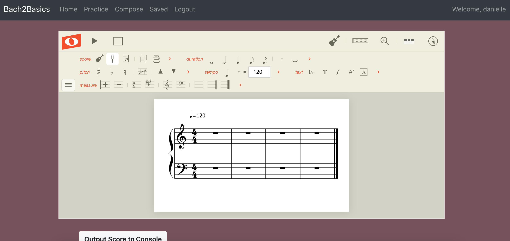

# "Bach to Basics” 🎹

(*Note - This is Jon Curto's fork for doing cleanup and updates in preparation for a career demonstration.  Thanks Sarah, Kevin and Danielle for all the hard work they poured into this.  No matter where I take this, I will make sure to always credit them - this is theirs as much as mine.)

(https://bach2basics.herokuapp.com/)

  (https://docs.google.com/presentation/d/1I-QFC4zUMG_RdNnN4ZCVjx-3urke5SH_w7F_j5xTA38/edit?usp=sharing)

## Description

Bach to the Basics allows users to sign up and save songs, practice scales, and compose music. This app uses bcrypt in order to allow users to have their own personal log in. Once logged in they will be able to use a react piano and practice all the major and minor scales. Noteflight API is incorporated into the Compose page and allows the user to compose music and export MIDI files and save their new songs in the database.

## Here we go
Let's get Bach to the Basics! What are scales? Modes? Chords? What do they sound like? What are they good for? Why should I learn them?

Bach to the Basics lets you explore the “Fun” -damentals of music in a fun and interactive way.
On the “Practice and Learn” page you can listen to chords and scales, hear famous melodies that use them, and interact with the music to learn and to try out new ideas.
On the Compose page you can create your own music, and do other cool stuff.

### Home Page

### Practice Page

### Compose Page

## Team Members

* "Danielle Blaney" <https://github.com/DaniBlaney>
* "Kevin O'Connel" <https://github.com/ko513>
* "Jon Curto" <https://github.com/Soggytoast111>
* "Sarah Kiel" <https://github.com/skiel14>

## Built With

* React JS
* React-piano 
* Noteflight API
* Nodejs
* Mongodb/Mongoose
* React Bootstrap - The web framework used
* React Router Dom
* Axios
* Bcrypt

## Beyond our MVP

* Import MIDI files to practice on the piano
* And put more stuff here....

----------------------------------------------------------------------------------------------------------------------------

This project was bootstrapped with [Create React App](https://github.com/facebook/create-react-app).

## Available Scripts

In the project directory, you can run:

### `npm start`

Runs the app in the development mode. 
Open [http://localhost:3000](http://localhost:3000) to view it in the browser.

The page will reload if you make edits. 
You will also see any lint errors in the console.

### `npm test`

Launches the test runner in the interactive watch mode. 
See the section about [running tests](https://facebook.github.io/create-react-app/docs/running-tests) for more information.

### `npm run build`

Builds the app for production to the `build` folder. 
It correctly bundles React in production mode and optimizes the build for the best performance.

The build is minified and the filenames include the hashes. 
Your app is ready to be deployed!

See the section about [deployment](https://facebook.github.io/create-react-app/docs/deployment) for more information.

### `npm run eject`

**Note: this is a one-way operation. Once you `eject`, you can’t go back!**

If you aren’t satisfied with the build tool and configuration choices, you can `eject` at any time. This command will remove the single build dependency from your project.

Instead, it will copy all the configuration files and the transitive dependencies (Webpack, Babel, ESLint, etc) right into your project so you have full control over them. All of the commands except `eject` will still work, but they will point to the copied scripts so you can tweak them. At this point you’re on your own.

You don’t have to ever use `eject`. The curated feature set is suitable for small and middle deployments, and you shouldn’t feel obligated to use this feature. However we understand that this tool wouldn’t be useful if you couldn’t customize it when you are ready for it.

## Learn More

You can learn more in the [Create React App documentation](https://facebook.github.io/create-react-app/docs/getting-started).

To learn React, check out the [React documentation](https://reactjs.org/).

### Code Splitting

This section has moved here: https://facebook.github.io/create-react-app/docs/code-splitting

### Analyzing the Bundle Size

This section has moved here: https://facebook.github.io/create-react-app/docs/analyzing-the-bundle-size

### Making a Progressive Web App

This section has moved here: https://facebook.github.io/create-react-app/docs/making-a-progressive-web-app

### Advanced Configuration

This section has moved here: https://facebook.github.io/create-react-app/docs/advanced-configuration

### Deployment

This section has moved here: https://facebook.github.io/create-react-app/docs/deployment

### `npm run build` fails to minify

This section has moved here: https://facebook.github.io/create-react-app/docs/troubleshooting#npm-run-build-fails-to-minify
# group7-project3
